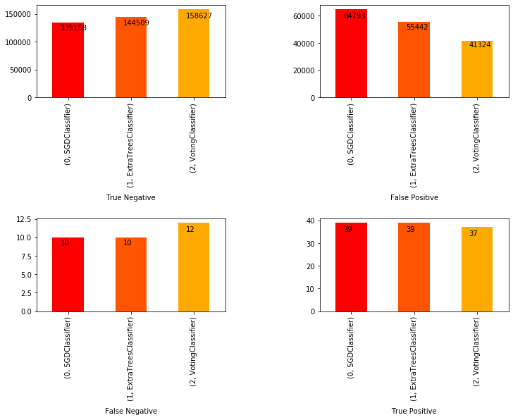

# click-through-rate-prediction (imbalanced dataset)
 
To predict click-through rate a VotingClassifier model was created by combining two separate models, namely , SGDClassifier and ExtraTreesClassifier. As can be observed from the results shown below, by combining these models the false positive rate is reduced to the lowest value.

 </img>

