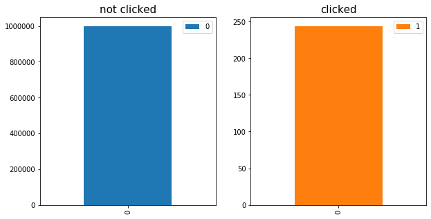

# Click-Through Rate

 ## Project Overview
 
Click-through rate is an indicator that shows how likely your advertisement will be noticed and clicked on by visitors of a website. The main aim of the current project is to predict click through rate based on a dataset containing various features related to user interaction with ads. The data has been anonymized, with the websites where the advertisement was shown and the brand it belonged to have been replaced by other values. The project has been broken down into multiple jupyter notebooks for simplicity. 

## Problem Statement
Due to the low likelihood of a visitor to click an advertisement the dataset utilized here is imbalanced, meaning that one group in the dataset is present with much higher number of records. The goal here is to predict as many users that are likely to click the ad as possible while reducing the number of false positives. The main reason for reducing the number of false positives is due to the fact that a cost can be associated with the number of times the algorithm falsely identifies a visitor as someone who is likely to click your ad. An example of this is when you would want to provide a discount code to a targeted set of users, the more visitors are able to see the discount code the lower your bottom line will be.
<p align='center'>

</p>

## Brief Exploratory Data Analysis

Here we pose three questions and will try to answer them by performing exploratory data analysis. 
```  
Is there a relationship between the time a user spends on the website and their likelihood of clicking the ad?
```  
<p align='center'>
 </img>
</p>
As can be observed from the above boxplots no clear correlation between the time a user spends on the website and their likelihood of clicking the ad exists.

```  
 Is there a pattern for the time of the day that more clicks were observed?
```  
<p align='center'>
 </img>
</p>

```  
 What time of the day are visitors more likely to click the ad?
```  

<p align='center'>
 </img>
</p>

As can be seen from the above figure a clear pattern for when more clicks are expected emerges that is very similar to the sleeping habits of human beings.

```  
 Is there a relationship between the website chosen for showing the ad and the likelihood of it being clicked?
```  
<p align='center'>
 </img>
</p>

The above figure shows that a higher number of ads were displayed on website_0 and more clicks were observed for this website. However, this just shows that there is a preference for selecting to show ads on this specific website.


```  
 Is there a relationship between the color of the ad and the number of clicks?
```  

<p align='center'>
 </img>
</p>

Surprisingly, yes. The color pink seems to attract more attention. This can also be observed across multiple brands.

<p align='center'>
 </img>
</p>


## Click-Through rate prediction
To predict click-through a voting model was created by combining two separate models, namely , SGDClassifier and ExtraTreesClassifier. As can be observed from the results shown below, by combining these models the false positive rate is reduced to the lowest value.


